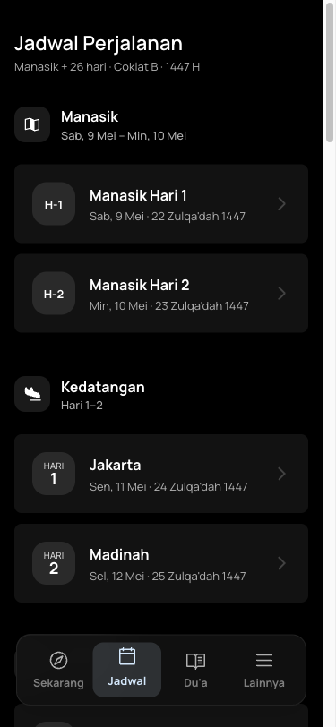
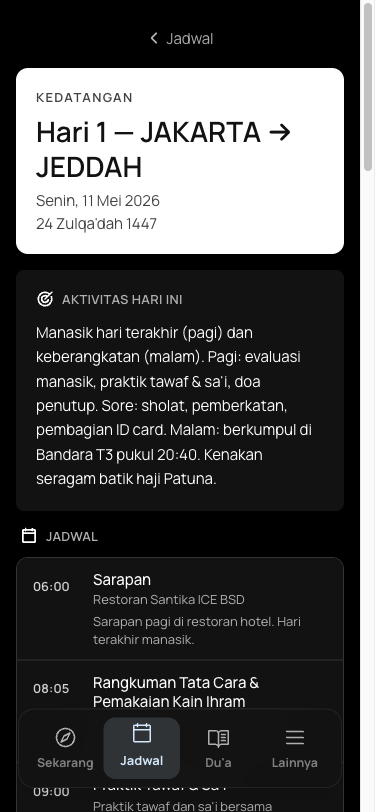
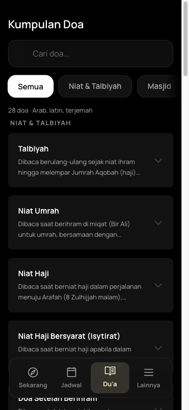

<div align="center">
  
  <h1>QUWA</h1>
  <h3>قُوَّة</h3>
</div>

# Patuna Coklat-B Hajj Companion

This repository contains the source code for the **Patuna Coklat-B Hajj Companion (QUWA)**, an offline-first Progressive Web App (PWA) built specifically for first-time Indonesian pilgrims embarking on the Hajj 2026 journey with Patuna Travel (Coklat B package).

This project is **publicly shared** and was **built with the help of Google Gemini**.

## 📖 About The Project

A first-time hajji is often anxious, jet-lagged, and surrounded by millions of people. With unreliable networks in Saudi Arabia, finding the right prayer, the next itinerary step, or emergency contacts can be challenging.

**QUWA** makes the answer to _"what do I do right now?"_ one tap away — offline, in Bahasa Indonesia, and tailored precisely to the Patuna Coklat-B schedule.

### Key Features

- **Now/Next Interface:** A context-aware homepage that tells you exactly what is happening now and what is coming next, shifting into a "Tomorrow Preparation" mode after Maghrib.
- **Offline-First Ritual Guide:** Step-by-step guidance for high-stakes ritual days (Umrah, Wukuf, Muzdalifah, Jumrah, Thawaf Wada) with Arabic niat, Latin transliteration, and Bahasa translation.
- **Du'a Library:** Bundled collection of essential prayers extracted from official guides, searchable and categorized.
- **Important Contacts:** Readily available Patuna muthawwif, Saudi emergency, and hotel information.
- **Climate Reference:** Typical weather norms for each city per Hijri date to help pilgrims prepare appropriately.

## 📸 Screenshots

<div align="center">
  
  
  
</div>

## 🛠 Tech Stack

Built with modern web technologies focused on offline capabilities, accessibility, and performance:

- **Frontend:** SvelteKit 2 + Svelte 5 (Runes) + TypeScript
- **Styling:** Tailwind CSS v4
- **Runtime & Build:** Bun
- **PWA:** `@vite-pwa/sveltekit` with Workbox for robust offline caching
- **Hosting:** Cloudflare Pages
- **Database:** Supabase Postgres (for minimal dynamic daily overrides)

## 🚀 Getting Started

To recreate or run this project locally:

```sh
# Install dependencies
bun install

# Start a development server
bun run dev

# Or start the server and open the app in a new browser tab
bun run dev --open
```

To create a production version:

```sh
bun run build
```

## 📜 License

This repository is free and open to use. It is released to the public domain so that anyone can use, modify, distribute, and build upon this code **without any restriction**.

---

_Bismillah hirrahmaan irrahiim. May this be of benefit, and may Allah accept the Hajj of every jamaah who uses it._
